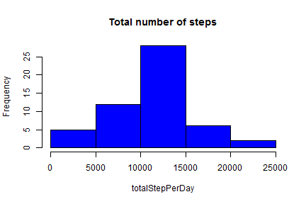
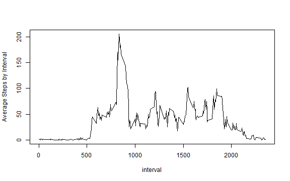
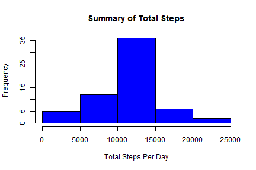
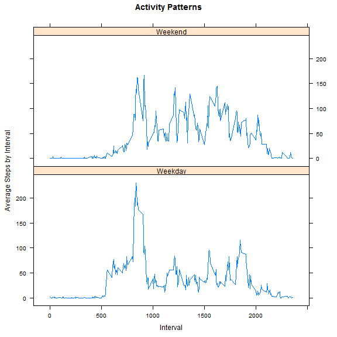

Title: Assignment one for Reproducible Research
=========================

*NOTE:Before executing the code, please download the file from Coursera website:*
[Activity monitoring data](https://d396qusza40orc.cloudfront.net/repdata%2Fdata%2Factivity.zip)

**Step 1: Loading and preprocessing the data**


```r
unziprepdata<-unzip("repdata-data-activity.zip")
repdata<-read.csv(unziprepdata, head=T, na.strings="NA")
head(repdata)
```

```
##   steps       date interval
## 1    NA 2012-10-01        0
## 2    NA 2012-10-01        5
## 3    NA 2012-10-01       10
## 4    NA 2012-10-01       15
## 5    NA 2012-10-01       20
## 6    NA 2012-10-01       25
```

```r
str(repdata)
```

```
## 'data.frame':	17568 obs. of  3 variables:
##  $ steps   : int  NA NA NA NA NA NA NA NA NA NA ...
##  $ date    : Factor w/ 61 levels "2012-10-01","2012-10-02",..: 1 1 1 1 1 1 1 1 1 1 ...
##  $ interval: int  0 5 10 15 20 25 30 35 40 45 ...
```

**Step 2: What is the mean total number of steps taken per day?**

2.1: Calculate the total number of steps taken per day  

```r
totalStepPerDay<-tapply(repdata$steps, repdata$date, sum)
totalStepPerDay
```

```
## 2012-10-01 2012-10-02 2012-10-03 2012-10-04 2012-10-05 2012-10-06 
##         NA        126      11352      12116      13294      15420 
## 2012-10-07 2012-10-08 2012-10-09 2012-10-10 2012-10-11 2012-10-12 
##      11015         NA      12811       9900      10304      17382 
## 2012-10-13 2012-10-14 2012-10-15 2012-10-16 2012-10-17 2012-10-18 
##      12426      15098      10139      15084      13452      10056 
## 2012-10-19 2012-10-20 2012-10-21 2012-10-22 2012-10-23 2012-10-24 
##      11829      10395       8821      13460       8918       8355 
## 2012-10-25 2012-10-26 2012-10-27 2012-10-28 2012-10-29 2012-10-30 
##       2492       6778      10119      11458       5018       9819 
## 2012-10-31 2012-11-01 2012-11-02 2012-11-03 2012-11-04 2012-11-05 
##      15414         NA      10600      10571         NA      10439 
## 2012-11-06 2012-11-07 2012-11-08 2012-11-09 2012-11-10 2012-11-11 
##       8334      12883       3219         NA         NA      12608 
## 2012-11-12 2012-11-13 2012-11-14 2012-11-15 2012-11-16 2012-11-17 
##      10765       7336         NA         41       5441      14339 
## 2012-11-18 2012-11-19 2012-11-20 2012-11-21 2012-11-22 2012-11-23 
##      15110       8841       4472      12787      20427      21194 
## 2012-11-24 2012-11-25 2012-11-26 2012-11-27 2012-11-28 2012-11-29 
##      14478      11834      11162      13646      10183       7047 
## 2012-11-30 
##         NA
```

2.2: Make a histogram of the total number of steps taken each day

```r
hist(totalStepPerDay, col="blue",main="Total number of steps")
```

 

2.3: Calculate the mean and median of the total number of steps taken per day  

```r
## Mean of the total number of steps taken per day 
mean(totalStepPerDay, na.rm=TRUE)
```

```
## [1] 10766.19
```

```r
## Median of the total number of steps taken per day 
median(totalStepPerDay, na.rm=TRUE)
```

```
## [1] 10765
```

**step 3: What is the average daily activity pattern?**

3.1: A time series plot

```r
interval<-unique(repdata$interval)
avgstepsbyinterval<-sapply(split(repdata$steps, repdata$interval), na.rm=TRUE, mean)
plot(interval, avgstepsbyinterval, type="l", xlab="interval", ylab="Average Steps by Interval")
```

 

3.2: Interval has maximal avg of numbers of steps

```r
newdata<-data.frame(interval, avgstepsbyinterval)
colnames(newdata)<-c("interval", "avgsteps")
newdata<-transform(newdata, interval=factor(interval))
intervalwithmaxvagsteps<-subset(newdata, avgsteps==max(avgstepsbyinterval))
intervalwithmaxvagsteps
```

```
##     interval avgsteps
## 835      835 206.1698
```

**step4: Imputing missing values**

4.1: Calculate and report the total number of missing values in the dataset

```r
#Total number of missing values
good<-complete.cases(repdata)
sum(!good)
```

```
## [1] 2304
```

```r
#General summary of missing values 
table(!good)
```

```
## 
## FALSE  TRUE 
## 15264  2304
```

```r
#Summary for each column with missing values
colSums(is.na(repdata))
```

```
##    steps     date interval 
##     2304        0        0
```

4.2: Devise a strategy for filling in all of the missing values in the dataset. The strategy does not need to be sophisticated. For example, you could use the mean/median for that day, or the mean for that 5-minute interval, etc.

```r
#A function to replace NA value with the mean for that interval
newrepdata<-data.frame()
for (i in interval){
   dat<-subset(repdata, repdata$interval==i)
   substeps <-subset(repdata$steps,repdata$interval==i)
   dat[is.na(dat)] <- mean(substeps, na.rm=TRUE)
   newrepdata<-rbind(newrepdata, dat)
}
```

4.3: Create a new dataset that is equal to the original dataset but with the missing data filled in.

```r
## rearrange the data according to date and interval
# Load "dplyr" package
library(dplyr)
newrepdata<-arrange(newrepdata, date, interval)
## Compare the new and old datasets
summary(newrepdata)
```

```
##      steps                date          interval     
##  Min.   :  0.00   2012-10-01:  288   Min.   :   0.0  
##  1st Qu.:  0.00   2012-10-02:  288   1st Qu.: 588.8  
##  Median :  0.00   2012-10-03:  288   Median :1177.5  
##  Mean   : 37.38   2012-10-04:  288   Mean   :1177.5  
##  3rd Qu.: 27.00   2012-10-05:  288   3rd Qu.:1766.2  
##  Max.   :806.00   2012-10-06:  288   Max.   :2355.0  
##                   (Other)   :15840
```

```r
summary(repdata)
```

```
##      steps                date          interval     
##  Min.   :  0.00   2012-10-01:  288   Min.   :   0.0  
##  1st Qu.:  0.00   2012-10-02:  288   1st Qu.: 588.8  
##  Median :  0.00   2012-10-03:  288   Median :1177.5  
##  Mean   : 37.38   2012-10-04:  288   Mean   :1177.5  
##  3rd Qu.: 12.00   2012-10-05:  288   3rd Qu.:1766.2  
##  Max.   :806.00   2012-10-06:  288   Max.   :2355.0  
##  NA's   :2304     (Other)   :15840
```

4.4: Make a histogram of the total number of steps taken each day and Calculate and report the mean and median total number of steps taken per day. Do these values differ from the estimates from the first part of the assignment? What is the impact of imputing missing data on the estimates of the total daily number of steps?


```r
## Make a histogram of the total number of steps taken each day
newtotalStepPerDay<-tapply(newrepdata$steps, newrepdata$date, sum)
hist(newtotalStepPerDay, col="blue", xlab= "Total Steps Per Day", main="Summary of Total Steps")
```

 

```r
## Mean of the total number of steps taken per day 
mean(newtotalStepPerDay, na.rm=TRUE)
```

```
## [1] 10766.19
```

```r
## Median of the total number of steps taken per day 
median(newtotalStepPerDay, na.rm=TRUE)
```

```
## [1] 10766.19
```

**Step5: Comparison of activity patterns between weekdays and weekends**


```r
## Formate date
dt<-as.Date(as.vector(newrepdata$date), "%Y-%m-%d")
## Create a new factor variable in the dataset with two levels - "weekday" and "weekend"
wkd<-c('Saturday', 'Sunday')
wd<-factor((weekdays(dt) %in% wkd), 
           levels=c(FALSE, TRUE), labels= c("Weekday", "Weekend"))
## Add one variable into the dataset
newrepdata$weekday<-wd
## Remove the "date" variable
newrepdata<-newrepdata[,-2]
## Summarize data by "weekday" and "interval" variables
grp_cols<-names(newrepdata)[-1]
dots<-lapply(grp_cols, as.symbol)
sumdata<-newrepdata %>% group_by_(.dots=dots) %>% summarize(avgstep=mean(steps))
## transform "weekday" variable to factor
sumdata<-transform(sumdata, weekday=factor(weekday))
## check summarized data 
head(sumdata)
```

```
##   interval weekday    avgstep
## 1        0 Weekday 2.25115304
## 2        0 Weekend 0.21462264
## 3        5 Weekday 0.44528302
## 4        5 Weekend 0.04245283
## 5       10 Weekday 0.17316562
## 6       10 Weekend 0.01650943
```

```r
## Plot data with lattice package
library(lattice)

xyplot(avgstep ~ interval|weekday,  data=sumdata, type = "l", layout=c(1, 2),
       xlab="Interval", ylab="Average Steps by Interval", main = "Activity Patterns")
```

 

